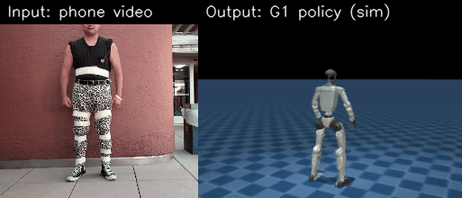

# Human jab → Unitree G1 jab policy

Hack Berkeley / Ultimate Bots Physical-AI hack. A full pipeline that turns a
**phone video of a person throwing a jab** into a **trained, deployable
motion-tracking policy for a real 29-DoF Unitree G1** — markerless mocap →
retarget → RL in sim → ONNX policy for the robot.



*Example training pair — **left:** raw phone video of a human jab; **right:** the same
motion as a 29-DoF G1 in sim (solid robot = the trained policy; translucent ghost =
the retargeted reference it tracks). One of ~120 such clips in the dataset.*

## The pipeline
```
phone video
  → GVHMR (markerless mocap: YOLO + ViTPose + HMR2.0 → world-grounded SMPL)
  → GMR  (retarget SMPL → 29-DoF G1 via IK)
  → CSV  (root pose + 29 joint angles per frame)        ← the handoff artifact
  → unitree_rl_mjlab  csv_to_npz → npz                  (MuJoCo, no Isaac Lab)
  → RL motion-tracking on an H100 → policy + policy.onnx (deployable)
  → unitree_sdk2 → real G1 throws the jab
```

## Architecture

Three independent stages — **capture → train → deploy** — connected by one portable
artifact: a **CSV of G1 joint angles**. Each stage is swappable and runs on different
hardware.

### 1. Capture — markerless mocap → G1 reference  *(laptop GPU)*
A phone video runs through four vision models, then a retargeter:
- **YOLOv8** → detect the person · **ViTPose-H** → 17 2D keypoints · **HMR2.0
  (4D-Humans)** → 3D body mesh · **GVHMR** → world-grounded SMPL motion (run with
  `-s`, no SLAM, for static-camera clips).
- **GMR** retargets the human SMPL motion onto the G1 by **inverse kinematics** —
  solving "which 29 G1 joint angles reproduce this motion," within joint limits.
  (Human body ≠ robot body, so you can't copy angles directly.)

**Output:** one **CSV** per clip — headerless, `root_pos[3] + root_rot(xyzw)[4] + 29
joints`, 30 fps. The contract between capture and training (format-verified against
the trainer *and* the robot URDF).

### 2. Train — RL motion tracking in sim  *(H100)*
The mocap gives a *kinematic* reference that isn't dynamically feasible — a real G1
holding those exact angles would topple. So we train a **policy (PPO)** that learns
to *track* the reference while staying balanced, under domain randomization, in
**`unitree_rl_mjlab`** (MuJoCo-Warp, GPU-parallel, 4096 envs).
- `csv_to_npz` adds body velocities/accelerations via forward kinematics.
- The **`Unitree-G1-Tracking-No-State-Estimation`** task is **deployable by design**:
  the policy observes only what the real robot can measure (joint encoders + IMU) — no
  privileged sim state.
- **Multi-motion:** the task tracks one motion, so we concatenate all ~99 clips into
  one long reference and the env samples random start points across it → **one policy
  for all jab variations.** (Single-clip training converges tighter for a crisp demo.)
- The policy is a small MLP: **observation → 29 joint-position targets** at ~50 Hz.

### 3. Deploy — ONNX policy on the robot  *(Jetson Orin)*
Training auto-exports **`policy.onnx`** (`obs → actions`). On the real **29-DoF** G1,
it runs on the onboard **Jetson Orin NX** and commands joints via **`unitree_sdk2`**
LowCmd (PD: target position + Kp/Kd, ~50 Hz). A deploy config maps the policy's joint
order to the SDK's `G1JointIndex` and sets the gains; validated in MuJoCo sim-to-sim
before hardware.

### Why this design
- **One portable artifact (CSV)** decouples capture from training — the H100 side never
  needs the mocap stack, and either trainer (`unitree_rl_mjlab` or Isaac/BeyondMimic)
  reads the same data.
- **Deployability is built in** — observation space, joint order, control rate, and the
  ONNX export all match the real robot from the start (not retrofitted).
- **Markerless** — a phone is the only capture hardware; no mocap suit or marker rig.

## Status
| Stage | State |
|---|---|
| Capture (video → GVHMR → GMR → CSV) | ✅ built + verified; **~120 clean CSVs** in `handoff/` |
| Data ↔ trainer format match | ✅ verified vs `csv_to_npz` (xyzw, 29-DoF, joint order) |
| Data ↔ hardware (29-DoF G1) | ✅ confirmed with Ultimate Bots |
| Training (RunPod H100, unitree_rl_mjlab) | ✅ single-clip + multi-motion proven; running |
| Deployable artifact (`policy.onnx`) | ✅ exported + validated (`obs → actions`) |
| On-robot deploy | ⏳ pending robot time |

## Repo layout / docs
- **`TRAINING_RUNPOD.md`** — ★ the real, reproducible training run (RunPod H100 +
  `unitree_rl_mjlab`: version pins, exact commands, results). Start here for training.
- **`CAPTURE_GUIDE.md`** — how to film the jab (camera angle, framing).
- **`handoff/HANDOFF.md`** — the CSV → npz → train handoff spec (format guarantees).
- **`G1_PLAN.md`** — approach & key decisions (the *why*).
- **`NEBIUS_TRAINING.md` / `AGENT_TRAIN_RUNBOOK.md`** — the Isaac-Lab/BeyondMimic
  ALTERNATIVE (planned, not the path we ran). Banner-flagged.
- **`handoff/`** — the ~120 validated G1-motion CSVs.
- **`runpod_out/`** — training checkpoints, progress renders, the `policy.onnx`.
- **`scripts/`** — the capture + processing tooling (below).

## Capture scripts (`scripts/`) — local, WSL/Linux
- `setup_capture.sh` — install GMR + GVHMR
- `09_gvhmr.sh` → `10_retarget.sh gvhmr` → `11_to_csv.sh` → `20_validate_motion.py` — per-clip chain
- `process_jab.sh <video>` — one-shot: video → validated CSV (auto-copies to `handoff/`)
- `batch_jabs.sh <dir>` / `monitor_batch.sh` — batch many clips + live progress
- `make_sidebyside.py` — build the raw-vs-render GIF above
- `extract_jabs.py`, `extract_body_models.py`, `analyze_csvs.py` — helpers

## Key facts (verified, reproducible)
- **GVHMR run with `-s`** (SLAM off) — right for static-camera in-place jabs; skips DPVO.
- **CSV format:** headerless, 36 cols = `root_pos[3] + root_rot_xyzw[4] + 29 dof`,
  G1-29dof joint order (matches both `unitree_rl_mjlab` and whole_body_tracking).
- **Trainer version pins** (repo leaves them unpinned, latest breaks): `mujoco==3.5.0`,
  `warp-lang==1.12.0`, `+scipy`; rendering needs EGL libs + `MUJOCO_GL=egl`.
- **Hardware:** 29-DoF G1, Jetson Orin NX, `unitree_sdk2` LowCmd PD ~50Hz.

## Results
~120 jab clips captured and validated; one policy trained on all of them
(multi-motion, error plateau ~0.7–0.8 rad = recognizable jab) plus a single-clip path
for a crisp demo; deployable `policy.onnx` produced. Progress renders + checkpoints in
`runpod_out/`.
