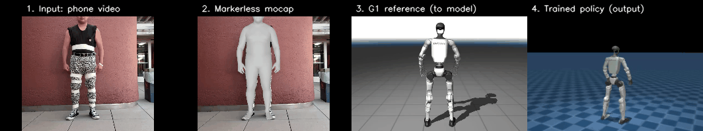
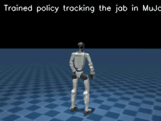

# ROBO JAB

## Human jab → Unitree G1 jab policy

AI Hackathon 2026 UC Berkeley / Ultimate Bots Physical-AI hack. The pipeline takes a phone video of
a person throwing a jab and produces a trained, deployable motion-tracking policy for
a real 29-DoF Unitree G1. Capture is markerless, training runs in sim, and the output
is an ONNX policy the robot can run.



_Reading the strip left → right: the raw phone video of a human jab; the markerless
mocap (GVHMR) that extracts the 3D motion; that motion retargeted onto the G1, which
becomes the CSV the model trains on; and the trained G1 policy executing the jab in
sim. One of about 120 clips in the dataset._

## Architecture

Three independent stages, capture → train → deploy, connected by one portable
artifact: a CSV of G1 joint angles. Each stage runs on different hardware and is
swappable on its own.

```
  CAPTURE  (laptop GPU / WSL)
  ────────────────────────────────────────────────────────────────────────
   phone video
      │   YOLOv8 → ViTPose-H → HMR2.0 → GVHMR   (world-grounded SMPL, run -s)
      │   detect   17 2D kpts   3D mesh   markerless mocap
      ▼   GMR : inverse-kinematics retarget (human SMPL → robot joints)
   29-DoF G1 joint angles
        │
        ▼
   CSV   root_pos[3] + root_rot_xyzw[4] + 29 joints  @ 30 fps   (headerless)
         ~120 clips · format-verified against the trainer and the G1 URDF
        │
  TRAIN  (RunPod H100)
  ────────────────────────────────────────────────────────────────────────
   csv_to_npz → npz   (+ body vel/accel via forward kinematics)
      │   ~99 clips concatenated → one reference, sampled per episode
      ▼   unitree_rl_mjlab · Unitree-G1-Tracking-No-State-Estimation  (PPO)
          MuJoCo-Warp, 4096 envs, domain randomization, ~50 Hz
          obs: joint encoders + IMU  →  MLP  →  29 joint-position targets
      │   auto-export
      ▼
   policy.onnx   (obs → actions)
        │
  DEPLOY  (Jetson Orin NX)
  ────────────────────────────────────────────────────────────────────────
   policy.onnx → unitree_sdk2 LowCmd PD   (q_des + Kp/Kd)
        joint-order map → G1JointIndex · sim-to-sim (MuJoCo) gate first
      ▼
   real 29-DoF Unitree G1 throws the jab
```

### Capture (laptop GPU)

A phone video runs through four vision models and then a retargeter. YOLOv8 detects
the person, ViTPose-H finds 17 2D keypoints, HMR2.0 (4D-Humans) lifts that to a 3D
body mesh, and GVHMR grounds it in world space as SMPL motion (run with `-s`, no SLAM,
for static-camera clips). GMR then retargets the human SMPL motion onto the G1 by
inverse kinematics, solving which 29 G1 joint angles reproduce the motion within the
robot's joint limits. A human body and a robot body differ, so you cannot copy angles
directly.

The output is one CSV per clip: headerless, `root_pos[3] + root_rot(xyzw)[4] + 29
joints`, at 30 fps. That CSV is the contract between capture and training, format-
verified against the trainer and the robot URDF.

### Train (H100)

The mocap gives a kinematic reference that is not dynamically feasible. A real G1
holding those exact angles would topple. The fix is a PPO policy that learns to track
the reference while staying balanced, under domain randomization, in
`unitree_rl_mjlab` (MuJoCo-Warp, GPU-parallel, 4096 envs). `csv_to_npz` adds body
velocities and accelerations via forward kinematics. The
`Unitree-G1-Tracking-No-State-Estimation` task is deployable by design: the policy
observes only what the real robot can measure (joint encoders and IMU), with no
privileged sim state.

The task tracks one motion at a time, so to cover every jab we concatenate all ~99
clips into one long reference and let the env sample random start points across it.
That gives one policy for all jab variations. The policy itself is a small MLP that
maps an observation to 29 joint-position targets at about 50 Hz.

### Deploy (Jetson Orin)

Training auto-exports `policy.onnx` with an `obs` input and an `actions` output. On
the real 29-DoF G1 it runs on the onboard Jetson Orin NX and commands joints via
`unitree_sdk2` LowCmd (PD control: target position plus Kp/Kd, about 50 Hz). A deploy
config maps the policy's joint order to the SDK's `G1JointIndex` and sets the gains.
It is validated in MuJoCo sim-to-sim before hardware.

### Why this design

One portable artifact, the CSV, decouples capture from training, so the H100 side
never needs the mocap stack and either trainer (`unitree_rl_mjlab` or
Isaac/BeyondMimic) reads the same data. Deployability is built in from the start
instead of retrofitted: the observation space, joint order, control rate, and ONNX
export all match the real robot. Capture stays markerless, so a phone is the only
capture hardware, with no mocap suit or marker rig.

## Status

| Stage                                    | State                                                          |
| ---------------------------------------- | -------------------------------------------------------------- |
| Capture (video → GVHMR → GMR → CSV)      | done and verified; ~120 clean CSVs in `data/`                  |
| Data ↔ trainer format match              | verified against `csv_to_npz` (xyzw, 29-DoF, joint order)      |
| Data ↔ hardware (29-DoF G1)              | confirmed with Ultimate Bots                                   |
| Training (RunPod H100, unitree_rl_mjlab) | done; multi-motion ran 10k iters, converged ~0.68 rad          |
| Deployable artifact (`policy.onnx`)      | exported and validated (obs → actions); in `runpod_out/final/` |
| Deploy config (29-DoF G1)                | generated and self-verified; drop-in package in `deploy_config/` |
| On-robot deploy                          | pending robot time (build deploy stack, sim-to-sim, hardware)  |

## Repo layout

| Path                                           | What it is                                                                                                                                                     |
| ---------------------------------------------- | -------------------------------------------------------------------------------------------------------------------------------------------------------------- |
| `TRAINING_RUNPOD.md`                           | The real, reproducible training run (RunPod H100, `unitree_rl_mjlab`): version pins, exact commands, results. Start here for training.                         |
| `DEPLOY.md`                                    | Pre-flight package for the real G1: the deploy contract (obs 154-dim, action 29, 50 Hz, gains, joint map) extracted from the saved config, plus the checklist. |
| `deploy_config/`                               | Drop-in deploy package for `unitree_rl_mjlab`'s `deploy/robots/g1` (29-DoF): generated `deploy.yaml`, `policy.onnx`, `jab.npz`, FSM snippet, plus the variant research. |
| `CAPTURE_GUIDE.md`                             | How to film the jab (camera angle, framing).                                                                                                                   |
| `data/README.md`                               | The CSV → npz → train data spec with format guarantees.                                                                                                        |
| `G1_PLAN.md`                                   | Approach and key decisions.                                                                                                                                    |
| `NEBIUS_TRAINING.md`, `AGENT_TRAIN_RUNBOOK.md` | The Isaac-Lab/BeyondMimic alternative we planned but did not run. Banner-flagged.                                                                              |
| `data/`                                        | The ~120 validated G1-motion CSVs.                                                                                                                             |
| `runpod_out/`                                  | Training checkpoints, progress renders, the `policy.onnx`.                                                                                                     |
| `scripts/`                                     | The capture and processing tooling.                                                                                                                            |

## Capture scripts (`scripts/`, local, WSL/Linux)

| Script                                                                            | Does                                                                        |
| --------------------------------------------------------------------------------- | --------------------------------------------------------------------------- |
| `setup_capture.sh`                                                                | install GMR and GVHMR                                                       |
| `09_gvhmr.sh` → `10_retarget.sh gvhmr` → `11_to_csv.sh` → `20_validate_motion.py` | the per-clip chain                                                          |
| `process_jab.sh <video>`                                                          | one-shot: video → validated CSV, auto-copies to `data/`                     |
| `batch_jabs.sh <dir>`, `monitor_batch.sh`                                         | batch many clips with live progress                                         |
| `make_filmstrip.py`                                                               | build the filmstrip GIF above (`make_sidebyside.py` is the 2-panel variant) |
| `extract_jabs.py`, `extract_body_models.py`, `analyze_csvs.py`                    | helpers                                                                     |

## Key facts (verified, reproducible)

GVHMR runs with `-s` (SLAM off), which suits static-camera in-place jabs and skips the
DPVO build. The CSV format is headerless with 36 columns, `root_pos[3] +
root_rot_xyzw[4] + 29 dof`, in G1-29dof joint order, and it matches both
`unitree_rl_mjlab` and whole_body_tracking. The trainer needs pinned versions because
the repo leaves them unpinned and the latest releases break: `mujoco==3.5.0`,
`warp-lang==1.12.0`, plus `scipy`, with rendering through the EGL libs and
`MUJOCO_GL=egl`. The target hardware is a 29-DoF G1 with a Jetson Orin NX, driven over
`unitree_sdk2` LowCmd PD at about 50 Hz.

## Sim-to-sim (the trained policy in MuJoCo)



The trained policy running in MuJoCo against the jab reference. The solid robot is the
policy; the ghost is the target motion it tracks. The same policy was loaded and run in
MuJoCo locally on the laptop 4060 (`scripts/wsl_local_mjlab_setup.sh` then
`scripts/wsl_local_sim.sh`) to confirm it executes end to end off the training box; this
clip is the converged-policy render, where GL was hardware-accelerated. This is the gate
before hardware (DEPLOY.md §6): it must track the jab and stay upright in sim first.

## Results

About 120 jab clips captured and validated. One policy trained on all of them
(multi-motion, 10k iterations on an H100) converged to about 0.68 rad joint error,
which reads as a recognizable jab. The deployable `policy.onnx`, the final checkpoint,
the 21 training checkpoints, the obs/action config (`params/`), and the converged
render are in `runpod_out/final/`. Per-cycle progress renders are in
`runpod_out/progress/`.
